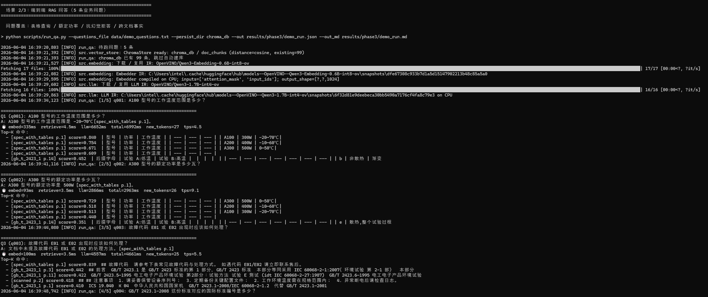
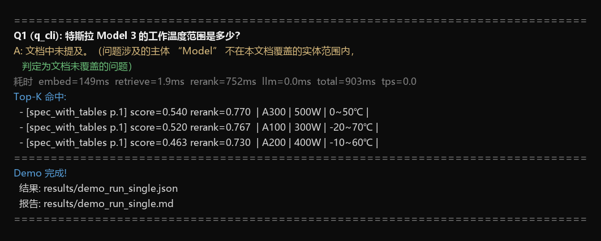

# 全链路本地化：用 PaddleOCR-VL + OpenVINO 打造带来源引用的文档问答系统

> 飞桨黑客松第 10 期 · 进阶任务 #13「基于 OpenVINO 的多模态文档理解与智能应用开发」参赛项目复盘。
> 代码已合入 PR：[openvinotoolkit/openvino_build_deploy#552](https://github.com/openvinotoolkit/openvino_build_deploy/pull/552)
> 项目仓库：[bob798/doc-qna-openvino](https://github.com/bob798/doc-qna-openvino)

## 一、为什么做这个项目

企业里最常见的知识载体不是数据库，而是 PDF：产品手册、规格表、扫描件、国标文档。想对它们提问，通常要么把文档上传到云端大模型（数据出域，敏感场景不可接受），要么自建 RAG（检索增强生成）系统——而自建系统最容易死在第一步：**文档解析**。

- 纯文本抽取（pdfplumber 之类）对扫描件无能为力；
- 传统 OCR（Tesseract）能认字，但表格结构全丢——我们实测一张规格表页，Tesseract 输出与真值的字符相似度只有 **9.55%**，rowspan/colspan 信息完全丢失；
- 表格恰恰是产品手册里最有价值的部分："A300 的额定功率是多少"这种问题，答案就藏在表格单元格里。

这个项目要回答的问题是：**能不能用一套完全跑在本地 CPU 上的开源方案，把"扫描件进、可引用的答案出"这条链路走通？**

答案是可以。三个模型、全部 OpenVINO 推理、无需任何云端 API：

| 角色 | 模型 | 大小 | 作用 |
|------|------|------|------|
| 文档解析 | [PaddleOCR-VL-1.5](https://huggingface.co/zhaohb/PaddleOCR-VL-1.5-ov)（0.9B VLM） | ~2.7 GB | PDF/扫描件 → 结构化 Markdown（含表格） |
| 向量化 | [Qwen3-Embedding-0.6B-int8](https://huggingface.co/OpenVINO/Qwen3-Embedding-0.6B-int8-ov) | ~600 MB | 1024 维多语言向量 |
| 生成 | [Qwen3-1.7B-int4](https://huggingface.co/OpenVINO/Qwen3-1.7B-int4-ov) | ~1 GB | RAG 问答 + 来源引用 |

## 二、总体架构与功能模块

```
PDF / 扫描件 / 规格表
        ↓
① PaddleOCR-VL（OpenVINO）      —— 视觉语言 OCR，输出结构化 Markdown
        ↓
② 表格感知切片（table-aware chunking）
        ↓
③ Qwen3-Embedding-0.6B-int8（OpenVINO）→ ChromaDB 向量库
        ↓
④ Qwen3-1.7B-int4（OpenVINO GenAI）—— RAG 生成，带 [文档名 p.页码] 引用
```

### 模块拆解

**① 文档解析（`src/doc_parser.py` + `src/inference.py`）**
对有文字层的 PDF 直接走文字层；对扫描页自动降级到 PaddleOCR-VL。VLM 式 OCR 的关键优势是输出**结构化 Markdown**——表格保留为 Markdown 表格，而不是一串乱序文字。

**② 表格感知切片（`src/chunker.py`）**
普通按段落切片会把表格拦腰截断。我们的做法：**表格每一行单独成 chunk，且携带表头作为上下文**。比如规格表的一行会被切成：

```
| 型号 | 额定功率 | 工作温度 |
| A300 | 500W | -10~55℃ |
```

这样"A300 额定功率"这种单元格级问题，向量检索能直接命中含答案的行。段落文本则按语义边界切分，并过滤页眉/页脚噪声（短于 60 字符的 boilerplate 会把真正的事实挤出 Top-K）。

**③ 向量化入库（`src/embedding.py` + `src/vector_store.py`）**
Qwen3-Embedding 经 OpenVINO int8 量化后在 CPU 上约 139 ms/chunk，99 个 chunk 全量入库约 14 秒。ChromaDB 持久化，二次运行直接复用索引。

**④ RAG 问答（`src/rag.py` + `src/llm.py`）**
Qwen3-1.7B-int4 通过 `openvino_genai.LLMPipeline` 加载，关闭 thinking 模式保证输出紧凑。抗幻觉三道防线：

1. **严格 system prompt**：只允许使用检索到的参考资料，答案必须带 `[文档名 p.页码]` 引用，找不到就答"文档中未提及"；
2. **检索相似度阈值（`--min_score`）**：Top-K 全部低于阈值时直接拒答，不给 LLM 猜的机会；
3. **来源引用可回溯**：每条答案都能定位到原文页码，人工可验证。

## 三、一步步复现

### 环境要求

- Python 3.10 / 3.11 / 3.12，Windows / Linux / macOS 均可
- 纯 CPU 即可运行（Intel i5 实测），有 Intel GPU 可 `--device GPU` 加速
- 磁盘约 8 GB（模型 + venv + 向量库）

### 1. 一键运行（推荐）

```bash
git clone https://github.com/openvinotoolkit/openvino_build_deploy
cd openvino_build_deploy/demos/doc_qna_demo
python main.py
```

就这一条命令。`main.py` 会自动检测并安装缺失依赖、首次运行时自动从 HuggingFace 下载 OpenVINO IR 模型、从仓库自带的解析结果构建 ChromaDB 索引，然后跑默认的 5 题 demo。

Windows 用户也可以直接双击 `setup/install.bat`，脚本会完成 clone → venv → 依赖 → 运行全流程。

### 2. 自定义玩法

```bash
# 单条提问（结果写入 results/demo_run_single.*，不会覆盖 5 题报告）
python main.py --question "A100 工作温度是多少？"

# 切换设备
python main.py --device GPU

# 换更大的 LLM（如果内存充足）
python main.py --llm_model_id OpenVINO/Qwen3-8B-int4-ov

# 调整抗幻觉阈值（0 关闭）
python main.py --min_score 0.35
```

### 3. Windows 踩坑记录（都已在代码里兜底）

- **控制台编码**：cmd 默认 cp1252，中文直接崩——代码里强制 `sys.stdout.reconfigure(encoding="utf-8")`；
- **symlink 权限**：无开发者模式时 huggingface_hub 建符号链接报错——设置 `HF_HUB_DISABLE_SYMLINKS=1`；
- **jinja2 缺失**：transformers 5.x 不再传递依赖 jinja2，而 `apply_chat_template` 必需它——`requirements.txt` 已显式声明 `jinja2>=3.1`。

## 四、运行效果

5 题端到端问答（CPU）：

| # | 问题 | 答案 |
|---|------|------|
| 1 | A100 型号的工作温度范围是多少？ | -20~70℃ `[spec_with_tables p.1]` |
| 2 | A300 型号的额定功率是多少瓦？ | 500W `[spec_with_tables p.1]` |
| 3 | 故障代码 E01/E02 如何处理？ | 保守拒答（原文只有"联系售后"一句指引） |
| 4 | GB/T 2423.1—2008 对应的国际标准编号？ | IEC 60068-2-1:2007 `[gb_t_2423_1 p.3]` |
| 5 | GB/T 2423.1—2008 的实施日期？ | 拒答（目标 chunk 被英文标题语义稀释，未进 Top-5——典型 retrieval miss） |

事实类问题全部答对且引用正确；答不了的问题明确拒答而不是编造——**对文档问答来说，"知之为知之"比"什么都敢答"更重要**。

域外问题测试：问"珠穆朗玛峰的高度是多少米？"，系统正确返回"文档中未提及"。







> 完整运行录屏见仓库 `assets/demo.mp4`。

### 性能（Intel i5，纯 CPU）

| 阶段 | 平均耗时 |
|------|----------|
| 查询向量化 | 69 ms |
| ChromaDB 检索 | 1.7 ms |
| LLM 生成 | 3,270 ms（~10.7 tok/s） |
| **端到端 / 题** | **~3.3 s** |

瓶颈显然在 LLM 生成。OpenVINO 的价值在于：1.7B int4 模型在没有独显的普通办公机上做到 10+ tok/s，问答体验已经可用；换 Intel GPU 实测还有约 1.47× 加速。

## 五、已知限制（诚实清单）

1. **简短指引类答案的保守拒答**：严格 prompt 下，1.7B 模型会把"联系售后"判为"没有处理方法"而拒答——这是抗幻觉的代价，7B+ 模型处理更好；
2. **语义稀释 chunk 的漏召回**：目标事实被英文标题等内容"稀释"时，小 embedding 模型可能漏掉，可调大 `--top_k` 或加 reranker；
3. **半域外问题的实体串台**：明显域外问题能被 `--min_score` 拦住，但"火星探测器的额定功率"这种"域外实体 + 域内字段"组合会以较高相似度命中"额定功率"chunk，1.7B 模型可能忽略主体不一致直接作答。实测本语料上域内问题 top-1 相似度 ≥ 0.72、域外问题 ≤ 0.47，把 `--min_score` 调到 0.5 可以在进 LLM 前拦住这类串台题——但阈值随语料变化，彻底解法需要 cross-encoder reranker 或实体一致性校验，这是下一步方向。

## 六、小结

这个项目验证了一条完全本地化的文档问答路线：**PaddleOCR-VL 负责"看懂"文档（尤其是表格），OpenVINO 负责让三个模型都跑得动，表格感知切片 + 严格 grounding 负责让答案可信可溯源**。全程无 GPU 依赖、无云端 API、数据不出本机——对手册问答、规格核对、标准检索这类场景，已经是一个可以直接落地的起点。

欢迎试用并提 issue：

- Demo PR：https://github.com/openvinotoolkit/openvino_build_deploy/pull/552
- 项目仓库（含 benchmark 与评测材料）：https://github.com/bob798/doc-qna-openvino

---

*本文是飞桨黑客松第 10 期（文心伙伴赛道 · Intel）进阶任务 #13 的参赛复盘，感谢 PaddlePaddle 与 Intel OpenVINO 团队的评审与反馈。*
